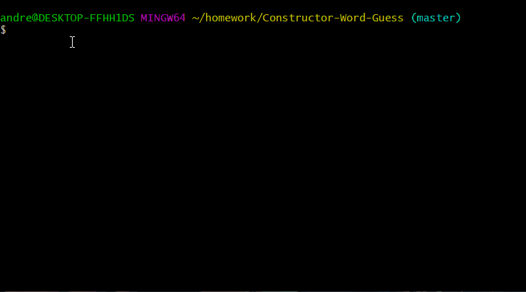
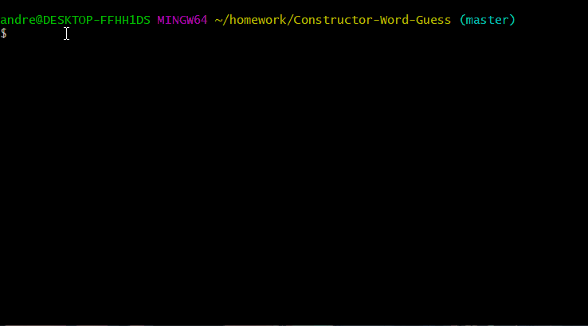

# Constructor-Word-Guess

This is a simple command line interface utilizing Node.js, as well as the NPM package Inquirer.
In order to run the script, the Inquirer package must be installed locally.  From the command line, run the following:

```npm install inquirer```

Once the npm has installed, you can initiate the program by entering the following on the command line:

```node index.js```

as the game begins, the command line will prompt the user to guess a letter.  The user types their guess and then presses enter.  A correct guess will yield that letter in the blank answer display.  Users are given 10 attempts to guess the mystery word.  After the user either correctly guesses the mystery word, or expends their 10 guesses, the game starts over.




This project allowed me to exercise my knowledge of the following:
* Javascript Constructors
* Node.js
* Modularization
* Mark Down
